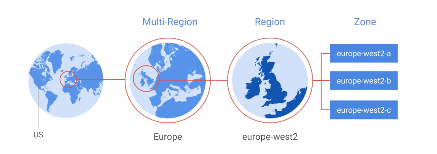
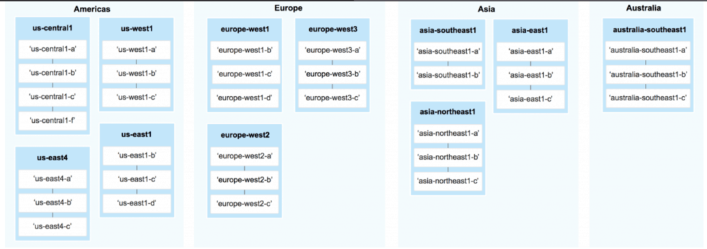

# Regions and Zones

## Regions
- independent geographic areas
- deployed with redundancy - hence HA than zonal. 
- Example, App engine

## Zones
- fast network connectivity within a region
- single failure domain in a region. 
- 

