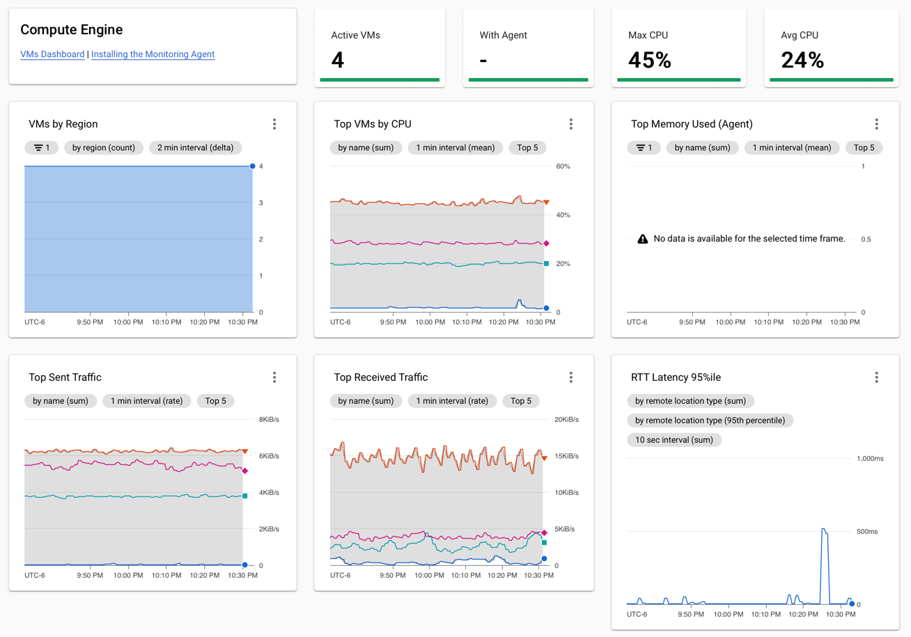
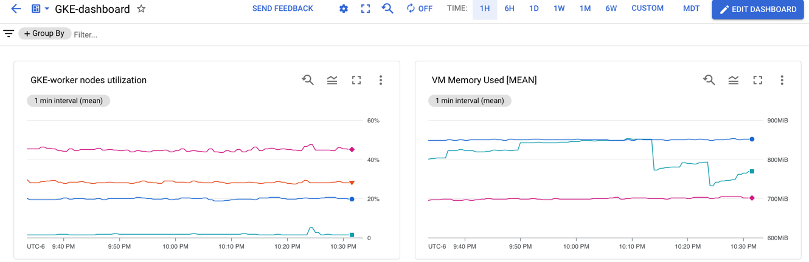
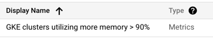
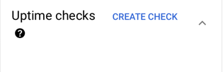
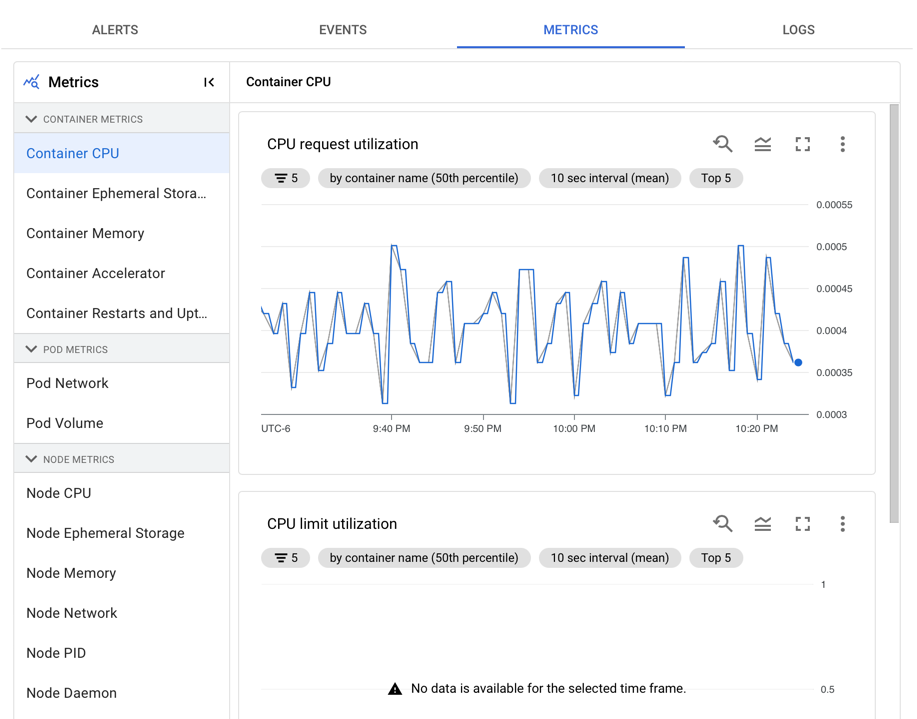
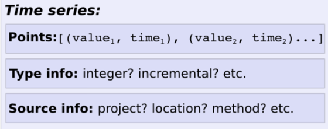
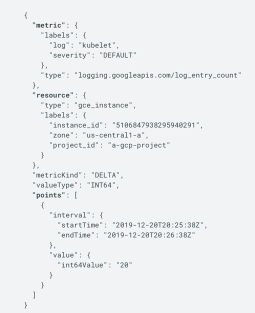
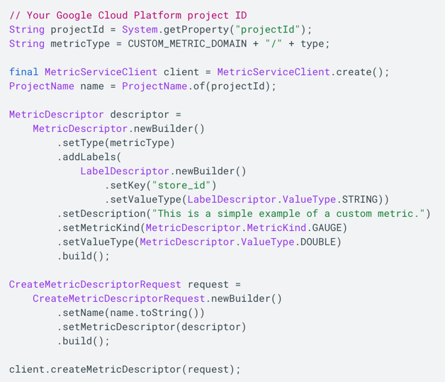

# Monitoring
What can you do using Google cloud monitoring:

## Charts and dashboards
- Monitor your google cloud resources and services using Pre-configured dashboards.

- lets you create custom dashboards for any google cloud resources. 

- Create alerting policies which will create incidents whenever the alerting policy fires. 

- Check service uptime check

- Using Integrations, you can connect to existing services such as Cassandra, nginx, redis, mysql and view more metrics in google cloud montioring. 
- Create services (Anthos Service mesh, Istio on GKE, App engine & user-defined microservice)

### Pre-configured datashboards. 
* VM instances
* Cloud storage, Disks, 
* GKE Dashboards: 
- list of clusters, namespaces, nodes metrics, workloads
- Container metrics


## Alerting policies and uptime checks. 

## Metrics Explorer
* Use existing resource metrics and create your own metrics chart. 

About metrics:



Sample time series:



Metric kind:
- Gauge metric: current temperature
- Delta metrics: http requests count. 
- Cumulative metric: Sent bytes might be cumulative. 

[Metrics list](https://cloud.google.com/monitoring/api/metrics)

## Custom metrics:
Custom metrics are metrics defined by you.
Steps:
* Determine the structure of your metric descriptor. 
* Determined the monitored resource against which the metric data is written. 
* Create a metricdescriptor object and pass to .create method.



#### Monitored resource
Monitored resource type
```text
gce_instance
gce_network
gce_disk
gke_container
networking.googleapis.com/Location
```
####
```text
compute.googleapis.com/instance/disk/read_bytes_count
```

[MQL](mql.md)