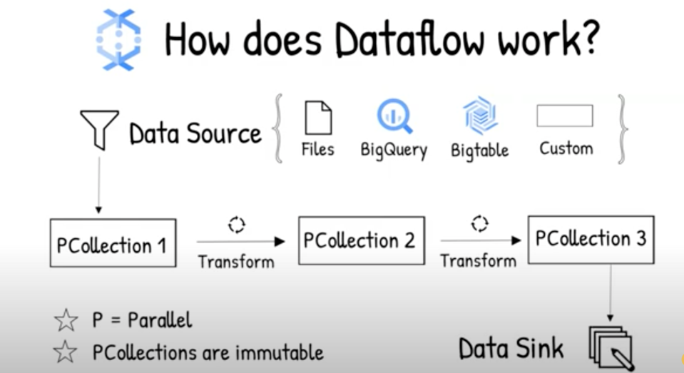
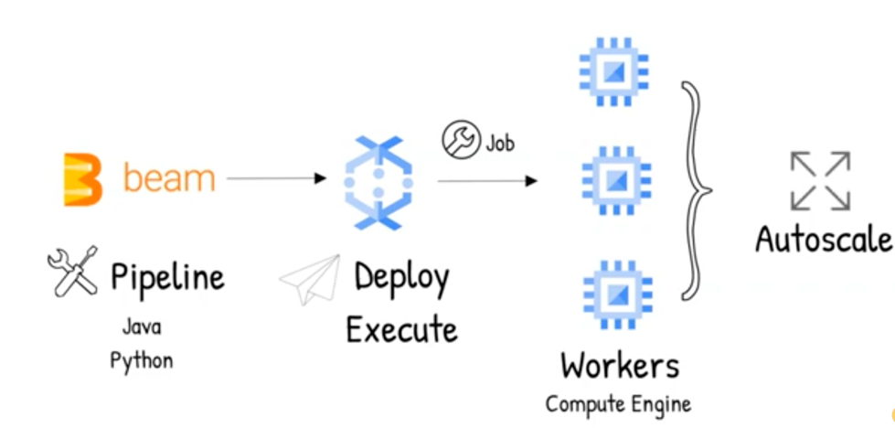

# Dataflow

## What is dataflow
    Dataflow is a serverless fast and cost-effective solution for streaming and batch processing for data injested from various sources.
Processing jobs are written using Apache beam libraries. Data is finally written to a sink. 

## How does this work.

