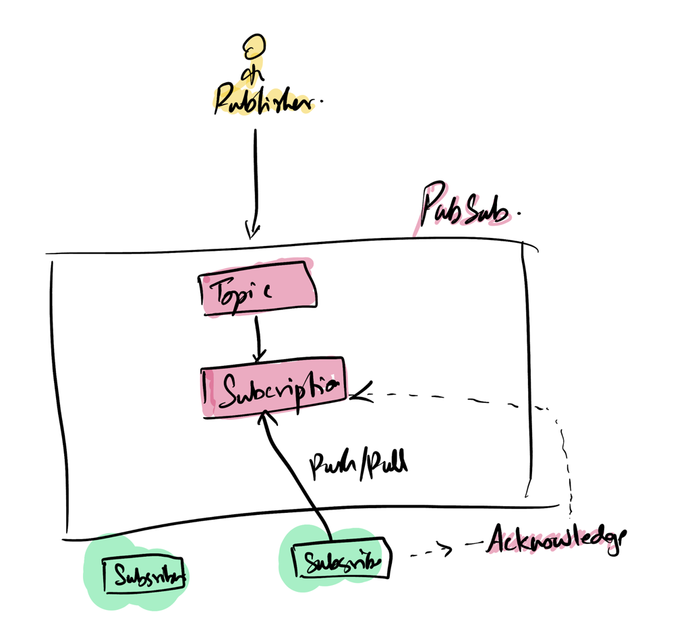
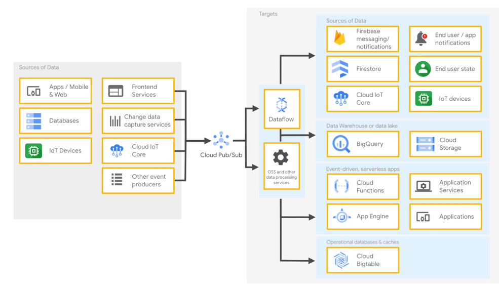

# Pubsub Overview
## What is pubsub

## Characteristics

## A typical use case 

* Publisher publishes a message to a pubsub topic
* Subscribers subscribe to the topic. 
* Each subscriber gets the topic either by pull or a push model. 
* Subscriber then acknowledges the topic. 
* Pubsub removes the message from the topic once all the subscribers acknowledged. 

## Overall picture

## Terms: 
* Publisher: 
  * Can be any service that can make https call to the googleapis.com
  * Example: Appengine app, service in a comupte engine, browser, Mobile/watch, IOT devices.
* Subscribers:
  * Can be any app that can make https call to 

## Types of communication
* Fan out: One to many
* Fan in: Many to one
* Many to many

## Tasks
