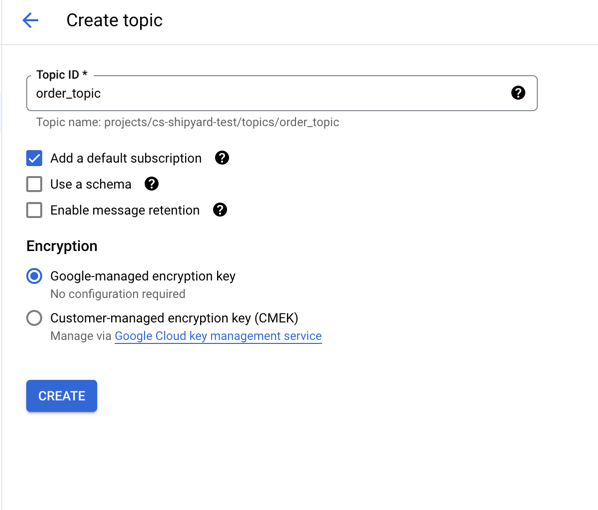
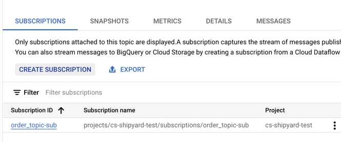
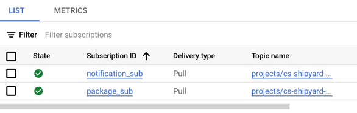

# Simple example

## 
* Create a topic: 
  * order_pub
* Create a subscription
  * notification_sub
  * package_sub

### Create a topic

### Create a subcription for the topic

### Setup service account and Cloud IAM
### Code publisher and subscriber apps
### Send sample messages

### Some considerations for Subscription:
* When sending json over rest, the message must be base64 encoded. 
* Smaller than 10MB after decoding. 
* Payload data must be having something or atleast one attribute. 

